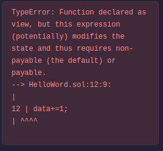

* ref to: https://docs.soliditylang.org/en/v0.8.17/introduction-to-smart-contracts.html#a-simple-smart-contract

# 第一个合约，简单的读写账本

~~~
// SPDX-License-Identifier: GPL-3.0

pragma solidity >=0.4.16 <0.9.6;

contract HelloWord{
    uint data;
    function set(uint x)public{
        data=x;
    }
    function get()public view returns(uint){//view?
                                            //return returns?
        return data;
    }                                       
}
~~~

## 关于合约部署

from是开发者的地址，to是null

## 关于view

solidity中对于函数是否读写账本状态的描述有两个关键词：view和pure。

* view：该函数不修改账本状态
* pure：该函数既不修改账本状态也不读取账本状态

如果试图在view函数里面修改账本状态：
~~~
function get()public view returns(uint){
	data+=1;//试图改变账本状态
	return data;
}
~~~
会得到这样的错误：

## 关于returns

solidity允许函数同时输出多个结果，例如下面的函数输出一个整形，一个字符串类型

~~~
  // SPDX-License-Identifier: GPL-3.0

pragma solidity >=0.4.16 <0.9.6;

contract testReturn{

    uint testintvalue;
    string teststrcvalue;

    constructor(){
        testintvalue=1;
        teststrcvalue="AAA";    
    }

    function getA() public view returns(uint,string memory){
        return(testintvalue,teststrcvalue);
    }
    
    function getB() public view returns(uint){
        uint test;
        (test,)=getA();
        return test;
    }
    function getC() public view returns(string memory){
        string memory testStr;
        (,testStr)=getA();
        return testStr;
    }
    function getD() public view returns(uint,string memory){
        uint test;
        string memory testStr;
        (test,testStr)=getA();
        return (test,testStr);
    }
}
~~~

solidity函数调用时允许部分或者全部接受另一个函数的多参数返回。

至于为什么string后面都要加memory，不然编译不过，待查！！！