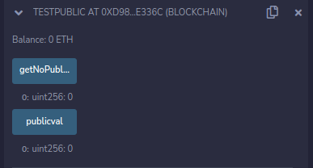

* ref to: https://docs.soliditylang.org/en/v0.8.17/introduction-to-smart-contracts.html#a-simple-smart-contract

# 代币合约

~~~
// SPDX-License-Identifier: GPL-3.0
pragma solidity ^0.8.4; //^?
contract YongCoin{
    address public minter; //public ?
    mapping (address=>uint) public balance;
    event Sent(address from,address to,uint amount);
    constructor(){
        minter=msg.sender;
    }
    function mint(address reciver,uint amount)public{
        require(msg.sender==minter);
        balance[reciver]=amount;
    }
    error InsufficientBalance(uint requested,uint available);
    function send(address reciver,uint amount)public{
        if(balance[msg.sender]<amount){
            revert InsufficientBalance({requested:amount,available:balance[msg.sender]}); //revert?
        }
        balance[msg.sender]-=amount;
        balance[reciver]+=amount;
        emit Sent(msg.sender,reciver,amount); //emit?
    }
}
~~~

## 关于合约solidity版本指定

* pragma solidity ^0.8.4：表示这个合约只能被0.8.X版本的编译器编译，不能被0.7.x和0.9.x版本的编译器编译
* pragma solidity >=0.4.16 <0.9.6：表示这个合约可以被0.4.16（包括）到0.9.6（不包括）内的任何版本编译器编译

## 账本变量上的 public

~~~
address public minter;
~~~
相当于
~~~
function minter() external view returns (address) { return minter; }
~~~

注意：不允许在地址类型上做任何算数运算

例如

~~~
pragma solidity ^0.8.4; 

contract testPublic{
    uint public publicval ;
    uint notpublicval;
    function getNoPublicValue()public view returns(uint){
        return notpublicval;
    }
}
~~~

notpublicval 如果没有借助public，需要写函数才能被外界获取到

## 关于mapping

这里需要注意和java里面map的区别：

solidity里面的mapping是不支持列举key值的，也不允许列举value值

## 关于构造函数

构造函数只在合约部署的时候被调用一次，后面不能再调用

## 关于特殊的全局变量

solidity中有三个特殊的全局变量：

* msg
* tx
* block

通过这些变量可以访问区块链本身的属性

## 创建用户和发送交易

在console里面查看账户

~~~
> eth.accounts
["0x6fa0055ea3c151efea40f20a2f09c9ad5f3256eb"]
~~~

创建一个账户，然后再查

~~~
> personal.newAccount()
Passphrase: 
Repeat passphrase: 
"0x4f68c41ec831054b60f01d96ab620bfacc2bc98a"
> eth.accounts
["0x6fa0055ea3c151efea40f20a2f09c9ad5f3256eb", "0x4f68c41ec831054b60f01d96ab620bfacc2bc98a"]
~~~

* remix里面调用mint，填入 0x6fa0055ea3c151efea40f20a2f09c9ad5f3256eb,100
* remix里面调用minter，返回 0x6fa0055ea3c151efea40f20a2f09c9ad5f3256eb
* remix里面调用balance，填入 0x4f68c41ec831054b60f01d96ab620bfacc2bc98a 返回 0；填入0x6fa0055ea3c151efea40f20a2f09c9ad5f3256eb 返回 100
* remix里面调用send，填入 0x4f68c41ec831054b60f01d96ab620bfacc2bc98a,50
* remix里面调用balance，填入 0x4f68c41ec831054b60f01d96ab620bfacc2bc98a 返回 50；填入0x6fa0055ea3c151efea40f20a2f09c9ad5f3256eb 返回 50

如果需要切换账户试一下代币互发，需要接SDK进行合约调用。监听send里面的event也是一样的，需要写程序接SDK。

## 关于 revert

revert与error一起使用，为调用者提供更多的错误信息，更重要的是revert将会中止函数调用并还原账本状态到函数调用之前的状态

~~~
pragma solidity >=0.4.16 <0.9.6;

contract testRevert{
    uint public testa;
    uint public testb;
    constructor(){
        testa=100;
        testb=100;
    }
    error testerror(uint,address);
    function test(uint testc)public{
        if(testc%10==0){
            testa+=10;
        }
        testrevert(testc);
    }
    function testrevert(uint testc)internal{
        if(testc%15==0){
            testb+=15;
        }else{
            revert testerror(testc,msg.sender);
        }
    }
}
~~~

当为test输入10的时候，由于testrevert抛出了错误，所以testb状态不会改变；
由于test内部调用了testrevert，testrevert抛出了错误，所以testa状态也不会改变