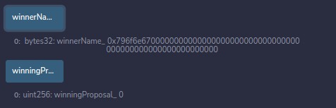

* ref to: https://docs.soliditylang.org/en/v0.8.17/solidity-by-example.html#solidity-by-example

# 投票合约

~~~
// SPDX-License-Identifier: GPL-3.0
pragma solidity >=0.7.0 <0.9.0;

contract Ballot{
    struct Voter{
        uint weight;
        bool voted;
        address delegate;
        uint vote;
    }
    struct Proposal{
        bytes32 name;
        uint voteCount;
    }
    address public chairperson;
    mapping(address => Voter)public voters;
    Proposal[] public proposals;
    constructor(bytes32[] memory proposalname){ //memory?
        chairperson=msg.sender;
        voters[chairperson].weight=1;
        for(uint i=0;i<proposalname.length;i++){
            proposals.push(
                Proposal(
                    {
                        name: proposalname[i],
                        voteCount: 0
                    }
                )
            );
        }
    }
    function giveRightToVote(address voter) external{ //external?
        require(
            msg.sender==chairperson,"only chairperson can give right to vote"
        );
        require(
            !voters[voter].voted,"the voter already voted."
        );
        require(
            voters[voter].weight==0
        );
        voters[voter].weight=1;
    }
    function delegate(address to) external{
        Voter storage sender=voters[msg.sender]; //storage?
        require(sender.weight!=0,"you have no right to vote");
        require(!sender.voted,"you have voted!");
        require(to!=msg.sender,"self-delegation is not allowed!");
        while(voters[to].delegate!=address(0)){ //address(0)?
            to=voters[to].delegate;
            require(to!=msg.sender,"found loop in delegation");
        }
        Voter storage delegate_ = voters[to];
        require(delegate_.weight>=1);
        sender.voted=true;
        sender.delegate=to;
        if(delegate_.voted){
            proposals[delegate_.vote].voteCount+=sender.weight;
        }else{
            delegate_.weight+=sender.weight;
        }
    }
    function vote(uint proposal) external{
        Voter storage sender=voters[msg.sender];
        require(sender.weight!=0,"has no right to vote");
        require(!sender.voted,"already voted!");
        sender.voted=true;
        sender.vote=proposal;
        proposals[proposal].voteCount+=sender.weight;
    }
    function winningProposal() public view returns(uint winningProposal_){ //returns with params?
        uint winningVoteCount=0;
        for(uint p=0;p<proposals.length;p++){
            if(proposals[p].voteCount>winningVoteCount){
                winningVoteCount=proposals[p].voteCount;
                winningProposal_=p;
            }
        }
    }
    function winnerName() external view returns(bytes32 winnerName_){
        winnerName_=proposals[winningProposal()].name;
    }
}
~~~

## 实操

### 初始化参数：

[aaa,bbb,ccc]

转成bytes32类型

[0x796f6e6700000000000000000000000000000000000000000000000000000000,0x6262620000000000000000000000000000000000000000000000000000000000,0x6363630000000000000000000000000000000000000000000000000000000000]

初始化用户：0x5B38Da6a701c568545dCfcB03FcB875f56beddC4

### 登记选民

0xAb8483F64d9C6d1EcF9b849Ae677dD3315835cb2
0x4B20993Bc481177ec7E8f571ceCaE8A9e22C02db
0x78731D3Ca6b7E34aC0F824c42a7cC18A495cabaB

### 委托投票

0xAb8483F64d9C6d1EcF9b849Ae677dD3315835cb2 委托给 0x4B20993Bc481177ec7E8f571ceCaE8A9e22C02db

### 投票

0x4B20993Bc481177ec7E8f571ceCaE8A9e22C02db 投 aaa 即第0个提案
0x78731D3Ca6b7E34aC0F824c42a7cC18A495cabaB 投 bbb 即第1个提案

### 查看投票结果

