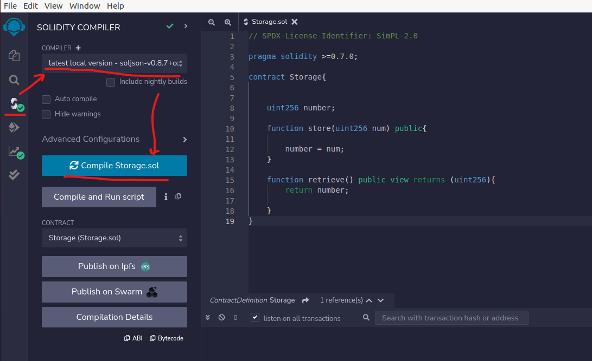
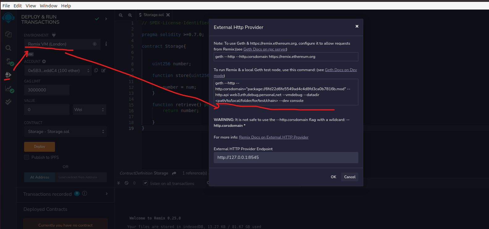
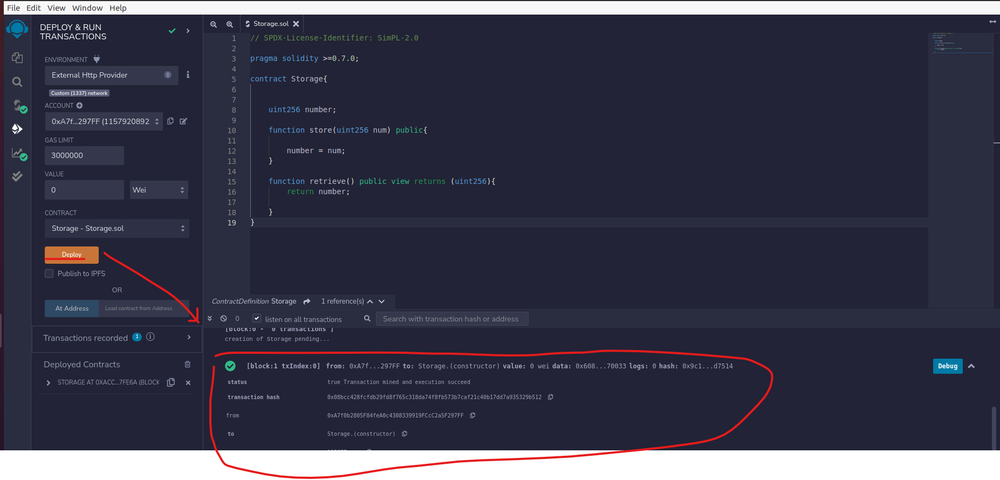
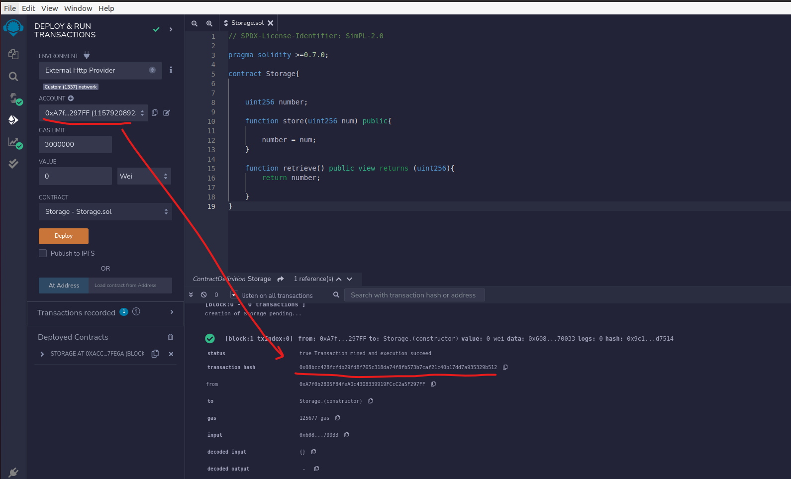
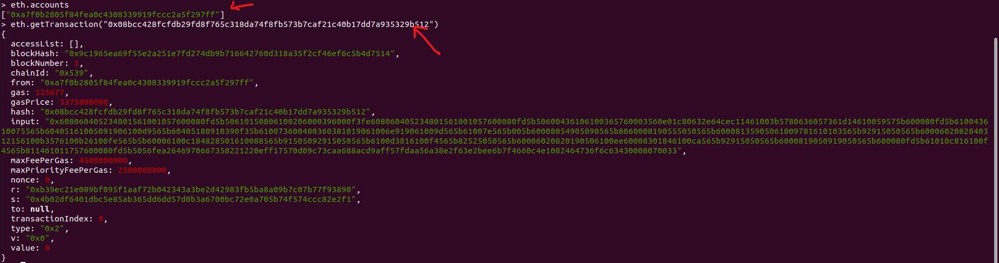

# 关于合并

1. Note that after The Merge a minimum of two clients are required to run an Ethereum node. These are an execution client and a consensus client. 

https://ethereum.org/en/developers/docs/nodes-and-clients/run-a-node/#client-settings

2. At the moment of the merge, execution clients will switch off their proof-of-work and block gossiping functions and hand responsibility for all consensus and fork choice logic over to consensus clients. This is a profound change to how Ethereum operates and it will require node operators to run a consensus client in addition to Geth.

https://geth.ethereum.org/docs/interface/merge

# 用Geth开发者模式+Remix搭建开发环境

参考：https://geth.ethereum.org/docs/getting-started/dev-mode

1. 下载Geth https://geth.ethereum.org/downloads/
2. 下载和安装remix
	1. 下载deb安装包 https://github.com/ethereum/remix-desktop/releases
	2. 安装：sudo dpkg -i XXX.deb
	3. 启动：remix-ide
	4. 开发和编译合约
	5. 连接本地Gethc测试节点这里可以看到，为了解决跨域问题，需要在geth启动时加上--http配置
3. 开发模式下启动Geth：geth --dev --http --http.api eth,web3,personal,net --http.corsdomain="package://6fd22d6fe5549ad4c4d8fd3ca0b7816b.mod"
4. Remix部署界面，点击deploy后，可以看到合约部署成功
5. js控制台连接节点：geth attach http://127.0.0.1:8545，查询部署交易

