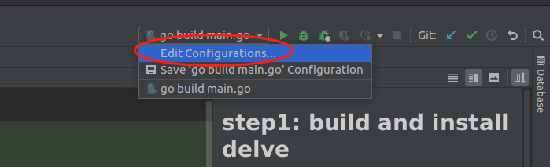
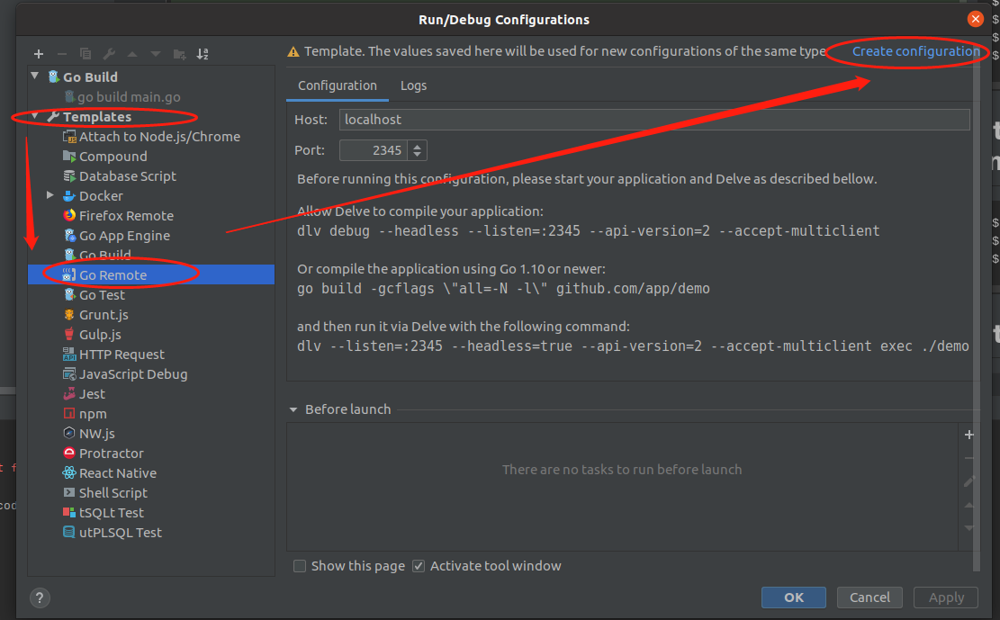
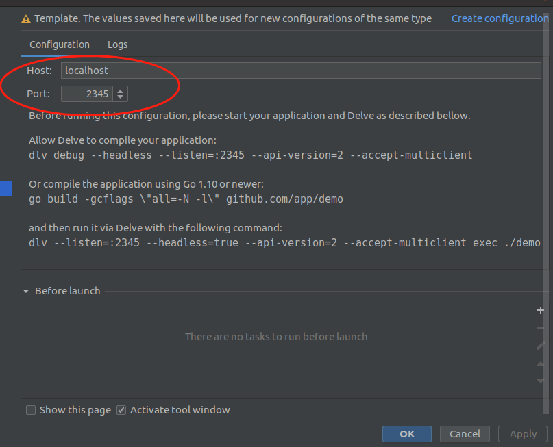

## step1: build and install delve
~~~shell script
$ go get github.com/go-delve/delve/cmd/dlv
$ cd $GOPATH/pkg/mod/github.com/go-delve/delve@v1.5.0/cmd/dlv
$ go build
$ go install
~~~

## step2: build docker image

~~~shell script
$ cp $GOPATH/bin/dlv .
$ docker build -f Dockerfile -t test:0.1 .
$ docker run -d  -p 8080:8080 -p 2345:2345 --privileged test:0.1
~~~

## step3: config goland

